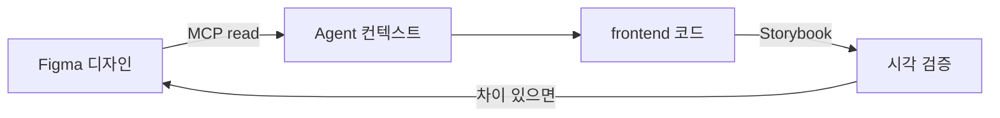

# Figma 연동 가이드 (Cursor + Figma MCP)

> P0.1 — Figma를 바이브코딩 **단일 기준 소스**로 연결하는 방법  
> **연관:** `design-tokens.md`, `milestones.md` P0.1, `architecture.md` §6

---

## 1. 사전 준비

| 항목 | 설명 |
|------|------|
| Figma 계정 | 디자인 파일 편집 권한 |
| Cursor Desktop | MCP 지원 버전 |
| Figma Desktop (권장) | Dev Mode·플러그인 연동 시 안정적 |

---

## 2. Cursor에서 Figma MCP 활성화

1. **Cursor Settings** → **MCP** (또는 Features → MCP Servers)
2. **Figma** 플러그인 MCP 서버가 목록에 있는지 확인  
   - 이 프로젝트: `plugin-figma-figma`
3. **처음 연결 시** 채팅에서 인증 필요 — Agent에게 *「Figma MCP 인증해줘」* 요청  
   - 또는 MCP 패널에서 **Authenticate** 클릭
4. 인증 후 `use_figma`, `get_metadata`, `get_screenshot` 등 도구 사용 가능

> MCP 상태 확인: Cursor MCP 폴더 `mcps/plugin-figma-figma/` — `STATUS.md`에 인증 필요 여부 표시

---

## 3. Figma 파일 연결 (프로젝트에 등록)

### 3.1 파일 URL 기록

아래 파일 **`docs/figma-file.md`** 에 디자인 파일 정보를 적습니다 (팀 공유용, URL만 — 토큰/키 금지).

```markdown
# Learners High — Figma

- **파일 URL:** https://www.figma.com/design/YOUR_FILE_KEY/Learners-High
- **fileKey:** `YOUR_FILE_KEY` (URL의 `/design/` 뒤 세gment)
- **기준 페이지:** Tablet / Landscape
- **담당:** (이름)
- **최종 동기화:** YYYY-MM-DD
```

### 3.2 Agent에게 파일 지정하는 방법

채팅 예시:

```
@docs/figma-file.md 이 Figma 파일 기준으로 홈 화면 컴포넌트 구조 읽어줘.
fileKey: xxxxxxxxx
```

또는 Figma에서 **Copy link to selection** → Agent에 URL 붙여넣기.

---

## 4. 바이브코딩 워크플로 (권장)



| 단계 | Agent 작업 | MCP / 도구 |
|------|------------|------------|
| 1 | Figma 페이지·컴포넌트 구조 파악 | `get_metadata`, `get_screenshot` |
| 2 | Variables(토큰) 추출 | `use_figma` (Variables API) |
| 3 | `tokens.css` / Storybook과 동기화 | 코드 편집 + `design-tokens.md` |
| 4 | 화면 단위 구현 | Figma MCP + `figma-generate-design` 스킬 |
| 5 | DoD 검증 | Storybook + Playwright |

**규칙 (architecture.md):**

- Figma에 없는 임의 레이아웃·색상 추가 금지
- 토큰은 Figma Variables → `frontend/src/styles/tokens.css`
- 공용 컴포넌트는 Figma Component ↔ 코드 컴포넌트 1:1 매핑 목표

---

## 5. P0.1 Figma 산출물 체크리스트

| ID | 화면/산출 | Figma 페이지 제안명 |
|----|-----------|---------------------|
| P0.1.1 | 와이어 (홈·타이머·정산·성장·마이·리포트) | `01-Wireframes` |
| P0.1.2 | 디자인 토큰 | `00-Tokens` (Variables) |
| P0.1.3 | 공용 컴포넌트 | `02-Components` |
| P0.1.4 | 성장 단계 에셋 | `03-Growth-Assets` |
| P0.1.5 | 정산 모달 4변형 | `04-Result-Modal` |

Figma 파일이 **아직 없으면:**

1. Figma에서 새 파일 생성 (Tablet Frame 1280×800)
2. `docs/figma-file.md`에 URL 등록
3. Agent에게: *「P0.1 체크리스트 페이지 골격을 Figma에 만들어줘」*  
   → `figma-create-new-file` / `figma-generate-design` 스킬 사용

---

## 6. Code Connect (선택)

컴포넌트 ↔ Figma 1:1 매핑이 필요하면 `.figma.ts` Code Connect 템플릿 추가 (Figma 플러그인 스킬 참고).

---

## 7. 문제 해결

| 증상 | 조치 |
|------|------|
| MCP 도구 안 보임 | Cursor 재시작, Figma 플러그인 MCP 재활성화 |
| 인증 실패 | MCP 패널에서 Re-authenticate |
| 파일 접근 거부 | Figma 파일 공유 권한 확인 |
| 토큰 불일치 | `design-tokens.md` ↔ Figma Variables 수동 diff |

---

## 8. 관련 문서

- [design-tokens.md](./design-tokens.md)
- [figma-file.md](./figma-file.md) ← **URL 등록**
- [milestones.md](./milestones.md) P0.1
