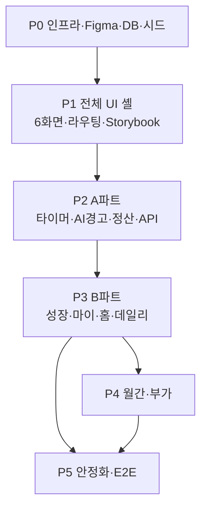
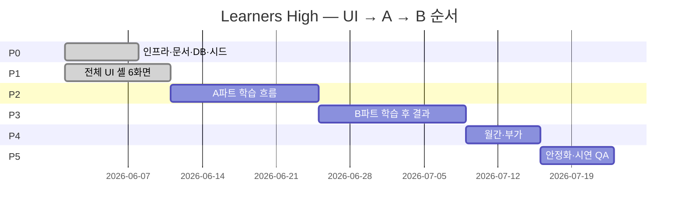
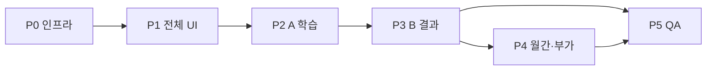

# milestones.md — 러너스하이(Learners High) 개발 마일스톤

> **목적:** PRD·아키텍처·DoD·세션 상태를 바탕으로 **단계별 구현 로드맵**을 고정한다.  
> **진행 원칙:** **① 전체 UI(실제 화면) → ② A파트 학습 흐름 기능 연동 → ③ B파트 학습 후 결과 흐름**  
> **사용 대상:** 개발자, Cursor/Claude 등 AI 어시스턴트  
> **연관:** `project_context.md`, `architecture.md`, `acceptance.md`, `session_context.md`, `figma-file.md`  
> **갱신:** 마일스톤 완료·범위 변경 시 본 문서 + `session_context.md` 동시 갱신

---

## 0. 로드맵 개요

### 0.1 3단계 진행 모델

| 순서 | 파트 | 마일스톤 | 한 줄 목표 |
|------|------|----------|------------|
| 0 | — | **P0** 기획 & 인프라 | 빌드·DB·시드·문서·Figma 기준선 |
| 1 | **UI** | **P1** 전체 UI 셸 | Figma 6화면 + 라우팅·토큰·목 데이터로 **화면만** 완성 |
| 2 | **A** | **P2** 학습 흐름 | 입실→타이머→AI 경고→종료→**정산 모달** + 정산 API·DB |
| 3 | **B** | **P3** 학습 후 결과 | 성장 대시보드·마이·홈 위젯·데일리 리포트 **기능 연동** |
| 4 | — | **P4** 리포트·부가 고도화 | 월간 리포트·순위·라이브러리·코칭 |
| 5 | — | **P5** 안정화 & 시연 QA | 전구간 E2E·Storybook·회귀·시연 Ready |

### 0.2 단계별 시연 목표 & 현재 상태

| 단계 | 명칭 | 시연 목표 | 현재 상태 |
|------|------|-----------|-----------|
| **P0** | 기획 & 인프라 | 개발·검증 환경 가동 | **`[x]` 완료** |
| **P1** | 전체 UI 셸 | 6화면 Figma 일치·탭 이동·목 UI | **`[x]` 완료** — Exit·Storybook·UI E2E·공용 컴포넌트; 시각 QA는 `docs/design-qa/p1-visual-checklist.md` 수동 서명 |
| **P2** | A파트 — 학습 흐름 | 타이머→AI경고→종료→정산 모달=DB | **부분** — 세션·mock-ai·정산 스캐폴드, DoD 미달 |
| **P3** | B파트 — 학습 후 | Garden·보관함·홈·데일리=DB | **부분** — Growth/My 스켈레톤, API·데일리 미완 |
| **P4** | 리포트·부가 고도화 | 월간·순위·라이브러리 | **미착수** |
| **P5** | 안정화 & 시연 QA | acceptance §4 전항목 | **부분** — E2E 2건·P0 스모크 |

### 0.3 A파트 / B파트 정의 (제품 기준)

**A파트 — 학생이 공부하는 과정 전체**

| # | 범위 | P1(UI만) | P2(기능) |
|---|------|----------|----------|
| A1 | 타이머 화면 (시작/정지·스톱워치 모드) | `TimerPage` Figma 정합 | API·store·계측 |
| A2 | AI 이탈 감지 → 경고 팝업 + 타이머 자동 정지 | 경고 UI·오버레이 정합 | mock-ai 주입·규칙 |
| A3 | 학습 종료 → 종료 정산 모달 (4변형) | `SessionResultModal` Figma·Storybook | 서버 확정만 표시 |
| A4 | 정산 데이터 계산 백엔드 API | — | `settlementService`·`StudySessionResult` |
| A5 | MongoDB 연결·시드·mock-ai | P0.3 | A 시나리오 시드·엣지 보강 |
| A6 | 입퇴실·계획 (타이머 선행) | 모달·캘린더 UI 셸 | API·DB·드래그앤드롭 |
| A7 | 집중 보호 (학습 중 보상 UI 없음) | 타이머 화면에 성취 DOM 없음 | E2E 회귀 |

**B파트 — 공부하고 난 뒤 결과를 보는 화면**

| # | 범위 | P1(UI만) | P3(기능) |
|---|------|----------|----------|
| B1 | 성장 대시보드 (나무 + 월간 화분 비주얼) | `GrowthDashboardPage` Figma | API·단계 에셋·애니 |
| B2 | 마이페이지 보관함 (배지 그리드·퀘스트 이력) | `MyPage` Figma | API·상세·Storybook |
| B3 | 홈 화면 위젯 연결 | `HomePage` Figma | 실 API 동기화·드릴다운 |
| B4 | 데일리 리포트 | `DailyReportPage` 신규 | aggregation API |
| B5 | 성장 캘린더 드릴다운 | 캘린더 UI 셸 | `GET /api/growth/.../history` |

### 0.4 전역 불변 원칙 (모든 마일스톤)

- **집중 우선** — 학습 중 성취/목표/성장 알림 금지, **종료 후 정산 모달**만
- **서버 권위** — 판정·점수·성장·정산은 `backend/src/services/`
- **SSOT** — `shared/types`, 실 MongoDB, 시딩 + mock-ai
- **P1 vs P2+** — P1은 **표시·네비·Figma·목 데이터**만. 비즈니스 판정·`$inc`는 P2(P3)부터

---

## P0 — 기획 & 인프라

**목표:** 모노레포·DB·문서·AI 워크플로우·시드 기반으로 **빌드·실행·검증**이 가능한 상태.

### P0.1 UI/UX 프로토타이핑 (Figma)

| ID | 작업 | 산출물 | DoD 매핑 | 상태 |
|----|------|--------|----------|------|
| P0.1.1 | 태블릿 가로 와이어프레임 6종 | Figma Page 2 + PNG | acceptance §3 | `[x]` |
| P0.1.2 | 디자인 토큰 | Variables → `tokens.css` | architecture §6 | `[x]` |
| P0.1.3 | 공용 컴포넌트 스펙 | `docs/component-spec.md` | acceptance §3.1 | `[x]` |
| P0.1.4 | 성장 단계별 에셋 매핑 (나무 0~4, 화분 0~4) | 단계-에셋 테이블 | acceptance §3.4 | `[x]` |
| P0.1.5 | 종료 정산 모달 변형 4종 | Figma Frames | acceptance §3.6 | `[x]` |

**Exit:** Figma·`design/figma-import/`가 바이브코딩 **단일 기준 소스**.

---

### P0.2 개발 환경 & AI 툴

| ID | 작업 | 산출물 | 상태 |
|----|------|--------|------|
| P0.2.1 | npm workspaces 모노레포 | `package.json` | `[x]` |
| P0.2.2 | TypeScript strict | `tsconfig.base.json` | `[x]` |
| P0.2.3 | Cursor 규칙 | `CLAUDE.md`, `.cursorrules` | `[x]` |
| P0.2.4 | SSOT 문서 | `docs/*` | `[x]` |
| P0.2.5 | ESLint + Prettier | 루트 설정 | `[x]` |
| P0.2.6 | Storybook (태블릿 가로) | `frontend/.storybook/` | `[x]` |
| P0.2.7 | Playwright | `e2e/playwright.config.ts` | `[x]` |
| P0.2.8 | `npm run dev` | API + FE + mock-ai | `[x]` |

**Exit:** `npm install` → `npm run build` → `npm run dev` → `npm run verify:p0` 성공.

---

### P0.3 MongoDB & 시딩

| ID | 작업 | 산출물 | 상태 |
|----|------|--------|------|
| P0.3.1 | Mongo 연결 | `.env`, `check-db` | `[x]` |
| P0.3.2 | Mongoose 모델 5종 | users, studySessions, milestones, goals, growthStates | `[x]` |
| P0.3.3 | `shared/types` ↔ 스키마 | `@learners-high/shared` | `[x]` |
| P0.3.4 | 대표 시나리오 seed | `backend/src/seeds/seed.ts` | `[x]` |
| P0.3.5 | mock-ai 시뮬레이터 | `backend/src/mock-ai/` | `[x]` |
| P0.3.6 | 엣지 시나리오 시드 | `seeds/scenarios.ts`, `docs/seeds.md` | `[x]` |
| P0.3.7 | `history`/`archive` 타입화 | `shared/types` | `[x]` |

**Exit:** `npm run check-db` + `npm run seed` 성공.

---

## P1 — 전체 UI 셸 (실제 화면 구현)

**목표:** Figma Page 2 **6 Frame**을 코드로 **픽셀·토큰 기준 구현**하고, 라우팅·목 데이터로 **모든 화면을 눌러볼 수 있는** 상태.  
**이 단계에서 하지 않음:** 정산 판정, `$inc`, aggregation, 실시간 API 동기화(하드코딩·fixture 허용).

**선행:** P0.1 Figma·토큰 · P0.2 Storybook

**화면 ↔ 파일 (SSOT: `docs/figma-file.md`)**

| 화면 | nodeId | 페이지/컴포넌트 |
|------|--------|-----------------|
| Home Dashboard | `64:495` | `pages/HomePage.tsx` |
| Study Timer + Focus Warning | `64:224` | `pages/TimerPage.tsx` |
| Session Result Modal | `64:384` | `components/result-modal/` |
| Growth Garden Dashboard | `64:3` | `pages/GrowthDashboardPage.tsx` |
| My Page — Collection | `64:637` | `pages/MyPage.tsx` |
| Daily Report | `64:856` | `pages/DailyReportPage.tsx` _(신규)_ |

---

### P1.1 디자인 시스템 & 공용 컴포넌트

| ID | 작업 | 산출물 | DoD | 상태 |
|----|------|--------|-----|------|
| P1.1.1 | `tokens.css` ↔ Figma Variables 전량 매핑 | `frontend/src/styles/` | acceptance §3 | `[x]` |
| P1.1.2 | Button / Card / Modal Figma 정합 | `components/ui/*` | acceptance §3.1 | `[x]` |
| P1.1.3 | Timer 디스플레이·모드 토글 UI | `components/timer/*` | acceptance §3 | `[x]` |
| P1.1.4 | Warning / Alert 오버레이 패턴 | `components/feedback/*` | acceptance §3 | `[x]` |
| P1.1.5 | AchievementGrid·GrowthStage 아이콘 슬롯 | `components/growth/*`, `mypage/*` | acceptance §3.4 | `[x]` |
| P1.1.6 | Storybook: 공용 컴포넌트 default/loading/error/empty | `*.stories.tsx` | acceptance §1 | `[x]` |
| P1.1.7 | `data-testid` 전 인터랙티브 UI | 컴포넌트별 | acceptance §1 | `[x]` |

---

### P1.2 앱 골격 — Shell·라우팅·목 데이터

| ID | 작업 | 산출물 | DoD | 상태 |
|----|------|--------|-----|------|
| P1.2.1 | AppShell Figma 사이드바·헤더 | `components/layout/AppShell` | acceptance §3 | `[x]` |
| P1.2.2 | React Router 6화면 등록 | `App.tsx` / routes | — | `[x]` |
| P1.2.3 | 화면별 fixture JSON (시드 스냅샷 형태) | `frontend/src/fixtures/` | — | `[x]` |
| P1.2.4 | 로딩/에러/빈 상태 **레이아웃** (목 전환) | `PageState` | acceptance §1 | `[x]` |
| P1.2.5 | 태블릿 가로 1280×1024 viewport 고정 | Storybook + App | acceptance §2.2 | `[x]` |

---

### P1.3 홈 대시보드 UI (`64:495`)

| ID | 작업 | 세부 | 상태 |
|----|------|------|------|
| P1.3.1 | 당일 계획 리스트 영역 (목 데이터) | 계획 카드·빈 상태 | `[x]` |
| P1.3.2 | 학습 상태 배너 (미입실/학습중/퇴실) | `StudyStatusBanner` | `[x]` |
| P1.3.3 | 성장 요약 위젯 (나무·화분 썸네일) | 클릭 → Garden _(라우트만)_ | `[x]` |
| P1.3.4 | 빠른 진입: 타이머·리포트·마이 | `HomeQuickLinks` | `[x]` |
| P1.3.5 | PNG 대비 시각 QA 체크리스트 | `docs/design-qa/p1-visual-checklist.md` | `[x]` |

---

### P1.4 타이머 & AI 경고 UI (`64:224`) — A1·A2 UI

| ID | 작업 | 세부 | 상태 |
|----|------|------|------|
| P1.4.1 | 스톱워치 / 카운트다운 모드 UI | `TimerModeToggle` | `[x]` |
| P1.4.2 | 시작 / 일시정지 / 종료 버튼 배치 | Figma 타이포·간격 | `[x]` |
| P1.4.3 | 이탈 경고 팝업 + 타이머 **정지 UI** (목 트리거) | `FocusWarningModal` + 시연 버튼 | `[x]` |
| P1.4.4 | 학습 중 **성취/퀘스트/성장 배너 없음** (정적 검증) | `data-focus-protected` | `[x]` |
| P1.4.5 | 종료 클릭 → 만족도·진척도 5점 입력 UI | 종료 플로우 셸 | `[x]` |
| P1.4.6 | PNG 대비 시각 QA | `docs/design-qa/p1-visual-checklist.md` | `[x]` |

---

### P1.5 종료 정산 모달 UI (`64:384`) — A3 UI

| ID | 작업 | 세부 | 상태 |
|----|------|------|------|
| P1.5.1 | `SessionResultModal` 레이아웃 Figma 정합 | `result-modal/` | `[x]` |
| P1.5.2 | 변형 4종 Storybook | Empty / Milestone / Quest / Combined | `[x]` |
| P1.5.3 | CTA: 성장 대시보드 / 마이페이지 (라우트만) | modal actions | `[x]` |
| P1.5.4 | fixture로 4변형 수동 시연 | `demoSettlementVariants` | `[x]` |

---

### P1.6 성장 대시보드 UI (`64:3`) — B1 UI

| ID | 작업 | 세부 | 상태 |
|----|------|------|------|
| P1.6.1 | Growth Garden 풍경 레이아웃 | `GrowthGarden` | `[x]` |
| P1.6.2 | 중심 누적 나무 + 주변 월간 화분 위성 배치 | `public/growth/*.svg` | `[x]` |
| P1.6.3 | 단계별 일러스트 슬롯 (0~4) | `growth-stages.css` | `[x]` |
| P1.6.4 | 캘린더 드릴다운 진입 UI (탭/버튼) | `GrowthCalendarPage` 셸 | `[x]` |
| P1.6.5 | PNG 대비 시각 QA | `docs/design-qa/p1-visual-checklist.md` | `[x]` |

---

### P1.7 마이페이지 보관함 UI (`64:637`) — B2 UI

| ID | 작업 | 세부 | 상태 |
|----|------|------|------|
| P1.7.1 | 성취 그리드 (달성/미달성 시각 구분) | `AchievementGrid` | `[x]` |
| P1.7.2 | 완료 퀘스트 이력 리스트 | 목 리스트 | `[x]` |
| P1.7.3 | 성취/퀘스트 상세 패널 (목 필드) | 일자·점수 placeholder | `[x]` |
| P1.7.4 | 허브 네비: Garden / 캘린더 | `mypage__hub` | `[x]` |
| P1.7.5 | PNG 대비 시각 QA | `docs/design-qa/p1-visual-checklist.md` | `[x]` |

---

### P1.8 데일리 리포트 UI (`64:856`) — B4 UI

| ID | 작업 | 세부 | 상태 |
|----|------|------|------|
| P1.8.1 | `DailyReportPage` 라우트·페이지 생성 | `pages/DailyReportPage.tsx` | `[x]` |
| P1.8.2 | 타임라인·코멘트·순공 요약 섹션 (fixture) | 목 차트/리스트 | `[x]` |
| P1.8.3 | AppShell 네비·홈 CTA 연결 | 라우트 + `HomeQuickLinks` | `[x]` |
| P1.8.4 | PNG 대비 시각 QA | `docs/design-qa/p1-visual-checklist.md` | `[x]` |

---

### P1.9 입퇴실·계획 UI 셸 (A 선행 UX)

| ID | 작업 | 세부 | 상태 |
|----|------|------|------|
| P1.9.1 | 입실 확인 모달 | `components/attendance/` | `[x]` |
| P1.9.2 | 퇴실 모달 — 목적 필수 선택 UI | validation UI only | `[x]` |
| P1.9.3 | 계획 캘린더/리스트 UI (드래그 핸들 시각만) | `components/plans/` | `[x]` |

---

### P1.10 P1 Exit — UI 단계 완료 기준

| ID | 검증 | 상태 |
|----|------|------|
| P1.10.1 | 6화면 AppShell 내 탭/링크로 **전부 진입** | `[x]` |
| P1.10.2 | Storybook 주요 변형 스토리 존재 | `[x]` |
| P1.10.3 | E2E `ui-navigation.spec.ts` — 라우트·`data-testid` 스모크 | `[x]` |
| P1.10.4 | TypeScript 0 · 토큰 하드코딩 없음 (신규 UI) | `[x]` |

**Exit (P1):** acceptance §3(디자인)·§3.4~3.6 **UI 수준** 충족. API 연동은 P2·P3.

---

## P2 — A파트: 학습 흐름 (기능 연동)

**목표:** **입실 → (계획) → 타이머 → mock-ai 이탈 경고 → 종료 → 백엔드 정산 → 정산 모달**이 실 DB·실 API로 동작.

**선행:** P1 Exit (특히 P1.4~P1.5 UI) · P0.3 DB·시드

---

### P2.0 A파트 데이터·인프라 (A5)

| ID | 작업 | 산출물 | DoD | 상태 |
|----|------|--------|-----|------|
| P2.0.1 | A 시나리오 전용 시드 (정산 있음/없음/복합) | `seeds/scenarios.ts` | `docs/seeds.md` | `[~]` |
| P2.0.2 | `check-db`·재기동 후 세션·성장 일관성 | 스크립트 | acceptance §1 | `[x]` |
| P2.0.3 | mock-ai 주기·시나리오 ID 문서화 | `docs/seeds.md` | acceptance §2.3 | `[~]` |

---

### P2.1 입퇴실·계획 API (A6)

| ID | 작업 | API | DoD | 상태 |
|----|------|-----|-----|------|
| P2.1.1 | 입실 기록 | `POST /api/attendance/check-in` | §2.1 | `[ ]` |
| P2.1.2 | 퇴실 + 목적 필수 | `POST /api/attendance/check-out` | §2.1 | `[ ]` |
| P2.1.3 | 귀가 리포트 발송 **모의** | service + log | §2.1 | `[ ]` |
| P2.1.4 | 계획 CRUD | `/api/plans` | §2.1 | `[ ]` |
| P2.1.5 | 계획 DnD 이동 | `PATCH /api/plans/:id` | §2.1 | `[ ]` |
| P2.1.6 | `userId` 일관 식별 | middleware/context | §2.1 | `[~]` |
| P2.1.7 | FE: P1.9 모달 ↔ API 연동 | attendance + plans | §2.1 | `[ ]` |

**스키마:** `attendanceRecords`, `studyPlans` — `shared/types` 선행.

---

### P2.2 세션·타이머 API (A1)

| ID | 작업 | API / 모델 | DoD | 상태 |
|----|------|------------|-----|------|
| P2.2.1 | 학습 시작/종료 고도화 | `/api/study/session/*` | §2.3 | `[~]` |
| P2.2.2 | 스톱워치 vs 타이머 `StudySession.mode` | schema | §2.3 | `[ ]` |
| P2.2.3 | 진척도·만족도 5점 저장 | end payload | §2.7 | `[ ]` |
| P2.2.4 | FE: TimerPage ↔ API·Zustand | `stores/study*` | §2.3 | `[ ]` |
| P2.2.5 | 클라이언트 시간 계측 + 서버 `duration` 정합 | service | §2.3 | `[ ]` |

---

### P2.3 mock-ai & 이탈 경고 (A2)

| ID | 작업 | 모듈 | DoD | 상태 |
|----|------|------|-----|------|
| P2.3.1 | mock-ai → 활성 세션 `aiEvents` 주입 | `/api/mock-ai/event` | §2.3 | `[~]` |
| P2.3.2 | 이탈 연속 N회 → 세션 플래그 | service 규칙 | §2.3 | `[ ]` |
| P2.3.3 | FE: 경고 팝업 + 타이머 자동 정지 | TimerPage | §2.3 | `[ ]` |
| P2.3.4 | 웹캠 원천 미저장 audit | 코드·로그 | §4 | `[ ]` |
| P2.3.5 | E2E: mock-ai 이탈 → 경고 → 정지 | `focus-warning.spec.ts` | §2.3 | `[ ]` |

---

### P2.4 종료 정산 — 백엔드 (A4)

| ID | 작업 | 모듈 | DoD | 상태 |
|----|------|------|-----|------|
| P2.4.1 | `conditionCode` 규칙 외부화 | `milestoneRules.ts` | §2.4 | `[ ]` |
| P2.4.2 | 성취 판정 (종료 시만) | `settlementService` | §2.4 | `[~]` |
| P2.4.3 | Goal 일/주/월 배정·갱신 | `goalService` | §2.5 | `[ ]` |
| P2.4.4 | 점수 산정 + `$inc` (lifetime·monthly 동시) | `growthService` | §2.6 | `[~]` |
| P2.4.5 | `StudySessionResult` DB 저장 **후** 조립 | settlementService | architecture §3.3 | `[~]` |
| P2.4.6 | mongoose 트랜잭션 | session+milestone+goal+growth | architecture §3.3 | `[ ]` |

---

### P2.5 종료 정산 — 프론트 (A3)

| ID | 작업 | 경로 | DoD | 상태 |
|----|------|------|-----|------|
| P2.5.1 | 종료 플로우: 만족도·진척도 → `POST` end | TimerPage | §2.7, §2.9 | `[ ]` |
| P2.5.2 | **서버 확정만** 모달 표시 (낙관적 UI 금지) | result-modal + store | §2.9 | `[~]` |
| P2.5.3 | 4변형 실데이터 분기 | modal variants | §2.9, §3.6 | `[ ]` |
| P2.5.4 | empty 결과 UX | modal | §2.9 | `[ ]` |
| P2.5.5 | CTA → Garden / My (라우트+상태) | modal actions | §2.9 | `[ ]` |

---

### P2.6 A파트 집중 보호 & E2E (A7)

| ID | 작업 | DoD | 상태 |
|----|------|-----|------|
| P2.6.1 | 학습 중 성취/퀘스트 DOM·토스트 없음 | §2.3, §1 | `[ ]` |
| P2.6.2 | E2E: 입실 → 타이머 → 종료 → 모달=DB | `study-flow-a.spec.ts` | `[ ]` |
| P2.6.3 | E2E: focus-protection 회귀 | `focus-protection.spec.ts` | `[~]` |
| P2.6.4 | E2E: 정산 재요청 일관성 | `settlement-consistency.spec.ts` | `[ ]` |

**Exit (P2 / A파트):** acceptance §2.1, §2.3, §2.4, §2.5, §2.7(입력), §2.9 + project_context §1.5 정산 관련.

---

## P3 — B파트: 학습 후 결과 (기능 연동)

**목표:** 정산 이후 사용자가 **성장·보관함·홈·데일리**에서 DB 기준 결과를 회고.

**선행:** P2 Exit (정산·점수·`growthStates` 갱신)

---

### P3.1 성장 백엔드 (B1·B5 기반)

| ID | 작업 | DoD | 상태 |
|----|------|-----|------|
| P3.1.1 | 성장 단계 임계치 상수 외부화 | architecture §3.1 | `[ ]` |
| P3.1.2 | lifetime + monthly 동시 `$inc` 검증 | §2.6 | `[~]` |
| P3.1.3 | 월초 monthly 리셋 + `archive` 이관 | §2.6 | `[ ]` |
| P3.1.4 | 월말 개화(고정) 트리거 | §2.6 | `[ ]` |
| P3.1.5 | `GET /api/growth/:userId/history?from&to` | §2.6 | `[ ]` |
| P3.1.6 | `history`/`archive` 응답 DTO 정합 | §1 | `[~]` |

---

### P3.2 성장 대시보드 FE (B1)

| ID | 작업 | 경로 | DoD | 상태 |
|----|------|------|-----|------|
| P3.2.1 | P1.6 UI ↔ growth API 바인딩 | `GrowthGarden` | §2.6 | `[ ]` |
| P3.2.2 | 단계 상승 시 에셋 전환 | stage mapping | §3.4 | `[ ]` |
| P3.2.3 | 캘린더 드릴다운 페이지 | `GrowthCalendarPage` | §2.6 | `[ ]` |
| P3.2.4 | 정산 직후 단계 반영 E2E | `growth-after-settlement.spec.ts` | §2.6 | `[ ]` |

---

### P3.3 마이페이지 보관함 (B2)

| ID | 작업 | DoD | 상태 |
|----|------|-----|------|
| P3.3.1 | 성취 그리드 API (`milestones`) | §2.10 | `[ ]` |
| P3.3.2 | 완료 퀘스트 이력 (`goals`) | §2.10 | `[ ]` |
| P3.3.3 | 상세 패널 (일자·점수) | §2.10 | `[ ]` |
| P3.3.4 | Garden / 캘린더 허브 네비 | §2.10 | `[ ]` |
| P3.3.5 | Storybook AchievementGrid 변형 | §1 | `[ ]` |

---

### P3.4 홈 위젯 연결 (B3)

| ID | 작업 | DoD | 상태 |
|----|------|-----|------|
| P3.4.1 | 당일 계획 ↔ `/api/plans` | §2.2 | `[ ]` |
| P3.4.2 | 학습 상태 ↔ attendance + active session | §2.2 | `[ ]` |
| P3.4.3 | 성장 위젯 ↔ `growthStates` 요약 | §2.2 | `[ ]` |
| P3.4.4 | 새로고침 후 값 일치 E2E | `home-dashboard.spec.ts` | §2.2 | `[ ]` |
| P3.4.5 | 위젯 → Growth Garden 드릴다운 | §2.2 | `[ ]` |

---

### P3.5 데일리 리포트 (B4)

| ID | 작업 | API / UI | DoD | 상태 |
|----|------|----------|-----|------|
| P3.5.1 | 일간 타임라인·코멘트 aggregation | `GET /api/reports/daily/:userId` | §2.7 | `[ ]` |
| P3.5.2 | P1.8 UI ↔ API 바인딩 | `DailyReportPage` | §2.7 | `[ ]` |
| P3.5.3 | 퇴실/귀가 → 리포트 랜딩 (P2.1.3) | flow | §2.1, §2.7 | `[ ]` |
| P3.5.4 | E2E: 종료 → 데일리 수치 일치 | `daily-report.spec.ts` | §2.7 | `[ ]` |

---

### P3.6 B파트 E2E

| ID | 시나리오 | 파일 |
|----|----------|------|
| P3.6.1 | 정산 → Garden 단계 반영 | `post-study-growth.spec.ts` |
| P3.6.2 | Garden → 캘린더 드릴다운 | `growth-calendar.spec.ts` |
| P3.6.3 | 마이 그리드·상세·허브 | `mypage-collection.spec.ts` |
| P3.6.4 | **Flow B:** 홈 → 학습 → 정산 → Garden → My → Daily | `flow-b-post-study.spec.ts` |

**Exit (P3 / B파트):** acceptance §2.2, §2.6, §2.7(데일리), §2.10.

---

## P4 — 리포트·부가 고도화

**목표:** B파트 이후 **월간 리포트·순위·라이브러리·코칭** 등 시연 보조 기능.

**선행:** P3 데일리·세션 데이터

### P4.1 월간·통계 API

| ID | 작업 | API | DoD |
|----|------|-----|-----|
| P4.1.1 | 월간 효율·과목별 추이 | `GET /api/reports/monthly/:userId` | §2.7 |
| P4.1.2 | 순공 heatmap | reports sub-resource | §2.7 |
| P4.1.3 | 지점 가상 순위 | `GET /api/reports/ranking` | project_context §3.1 |

### P4.2 월간·순위 UI

| ID | 작업 | DoD |
|----|------|-----|
| P4.2.1 | 월간 리포트 페이지 (차트) | §2.7 |
| P4.2.2 | 순공 캘린더 컴포넌트 | §2.7 |
| P4.2.3 | 순위 UI (강조 최소화) | project_context 리스크 |

### P4.3 부가 기능

| ID | 작업 | DoD |
|----|------|-----|
| P4.3.1 | 라이브러리 카테고리 필터 | §2.8 |
| P4.3.2 | 코칭 가상 예약 팝업 | §2.8 |
| P4.3.3 | QR/Link 다이렉트 접속 (모의) | §2.8 |

**Exit (P4):** acceptance §2.7(월간)·§2.8.

---

## P5 — 안정화 & 시연 QA

**목표:** **시연 가능 품질** — 전구간 E2E, Storybook 커버리지, 회귀.

### P5.1 품질 & DX

| ID | 작업 | DoD |
|----|------|-----|
| P5.1.1 | husky pre-commit (lint·typecheck) | architecture §4.5 |
| P5.1.2 | Storybook 전 공용 컴포넌트 커버리지 | acceptance §1, §3 |
| P5.1.3 | CI `npm run typecheck` 게이트 | acceptance §1 |
| P5.1.4 | 에러 바운더리·API 실패 UX | acceptance §1 |

### P5.2 낙관적 UI (정산 제외)

| ID | 작업 | DoD |
|----|------|-----|
| P5.2.1 | 계획 CRUD 낙관적 + reconcile | architecture §3.2 |
| P5.2.2 | 네트워크 지연 시뮬레이션 | project_context §3.2 |
| P5.2.3 | 정산 모달 non-optimistic 회귀 | acceptance §2.9 |

### P5.3 최종 E2E & 시연 QA

| ID | 시나리오 | 매핑 |
|----|----------|------|
| P5.3.1 | **Flow A:** 입실 → 타이머 → AI경고 → 종료 → 정산 | P2 |
| P5.3.2 | **Flow B:** 정산 → Garden → My → Daily | P3 |
| P5.3.3 | **Flow C:** 집중 보호 (학습 중 알림 없음) | P2.6 |
| P5.3.4 | **Flow D:** Garden → 캘린더 드릴다운 | P3.2 |
| P5.3.5 | **Flow E:** 마이페이지 회고 | P3.3 |
| P5.3.6 | 엣지 시드 (경계·다중 사용자) | `docs/seeds.md` |
| P5.3.7 | acceptance §4 최종 체크리스트 | 전체 |

**Exit (P5):** project_context §1.5 성공 지표 전체 + acceptance §4.

---

## 1. 마일스톤 간 의존성

| 후행 | 선행 필수 | 비고 |
|------|-----------|------|
| P1 화면 UI | P0.1 Figma·토큰 | fixture·목 데이터 OK |
| P2 타이머·정산 API | P1.4~P1.5 UI | UI 없이 API만 가능하나 비권장 |
| P2 정산 모달 연동 | P2.4 백엔드 | 서버 확정 후 FE |
| P3 성장·홈·데일리 | P2 정산·점수 | `growthStates` 갱신 필요 |
| P4 월간 리포트 | P3.5 데일리·세션 | aggregation 재사용 |
| P5 전구간 E2E | P2 + P3 최소 | P4는 선택 포함 |

---

## 2. acceptance.md → 마일스톤 매핑

| acceptance 섹션 | UI (P1) | 기능 (P2/P3) |
|-----------------|---------|----------------|
| §1 공통 DoD | P1.1, P1.10 | 전 단계 + P5.1 |
| §2.1 입퇴실·계획 | P1.9 | P2.1 |
| §2.2 홈 대시보드 | P1.3 | P3.4 |
| §2.3 타이머·AI | P1.4 | P2.2, P2.3 |
| §2.4 성취 | P1.5 (목) | P2.4 |
| §2.5 목표 | P1.5 (목) | P2.4 |
| §2.6 성장 시스템 | P1.6, P1.6.4 | P3.1, P3.2 |
| §2.7 리포트 | P1.8 | P3.5, P4 |
| §2.8 라이브러리·코칭 | — | P4.3 |
| §2.9 정산 모달 | P1.5 | P2.5 |
| §2.10 마이페이지 | P1.7 | P3.3 |
| §3 디자인 | **P1 전체** | Figma 유지 |
| §4 최종 체크 | — | P5.3 |

---

## 3. 권장 스프린트 (UI → A → B)

| 스프린트 | 마일스톤 | 기간(参考) | 핵심 산출 |
|----------|----------|------------|-----------|
| S0 | P0 | 완료 | 인프라·Figma·시드 |
| S1 | P1.1~P1.2 | 1주 | 디자인 시스템·Shell·fixture |
| S2 | P1.3~P1.8 | 1.5주 | 6화면 Figma 정합·Storybook·UI E2E |
| S3 | P2 | 2주 | A파트 전구간·정산 API·E2E |
| S4 | P3 | 2주 | B파트 Garden·My·홈·데일리 |
| S5 | P4 | 1주 | 월간·순위·부가 |
| S6 | P5 | 1주 | 전구간 E2E·시연 QA |

---

## 4. 현재 스냅샷 (session_context 연동)

> `session_context.md` §2 상태 보드와 동기화.

- **완료:** P0 전체 · **P1 전체 UI 셸 Exit** (6화면·fixture·Storybook·PageState·UI E2E·design-qa 체크리스트)
- **잔여(P1):** 없음 (PNG 픽셀 대비는 `docs/design-qa/p1-visual-checklist.md` 수동 서명)
- **스캐폴드만:** P2 세션·mock-ai·정산 / P3 Growth·My API
- **다음 우선순위 (권장):**
  1. P2.1 입퇴실·계획 API (+ FE fixture → 실 API 교체)
  2. P2.2 타이머 세션 API 연동
  3. P2.4 정산 백엔드 → P2.5 모달 서버 확정 연동
  4. P2.6 A파트 E2E (`study-flow-a.spec.ts`)

---

## 5. 관련 문서

- [project_context.md](./project_context.md) — 범위·A/B 성공 지표
- [architecture.md](./architecture.md) — 구조·컨벤션
- [acceptance.md](./acceptance.md) — Definition of Done
- [figma-file.md](./figma-file.md) — 6화면 nodeId 매핑
- [figma-workflow.md](./figma-workflow.md) — MCP·import
- [component-spec.md](./component-spec.md) — 공용 컴포넌트
- [design-tokens.md](./design-tokens.md) — 토큰
- [session_context.md](./session_context.md) — 세션별 진행 로그
