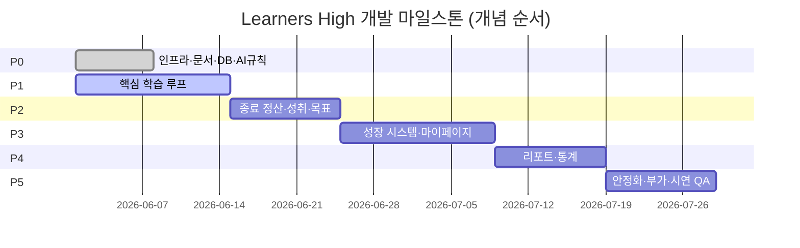
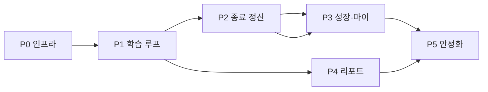

# milestones.md — 러너스하이(Learners High) 개발 마일스톤

> **목적:** PRD·아키텍처·DoD·세션 상태를 바탕으로 **단계별(P0~P5) 구현 로드맵**을 고정한다.  
> **사용 대상:** 개발자, Cursor/Claude 등 AI 어시스턴트  
> **연관:** `project_context.md`, `architecture.md`, `acceptance.md`, `session_context.md`  
> **갱신:** 마일스톤 완료·범위 변경 시 본 문서 + `session_context.md` 동시 갱신

---

## 0. 로드맵 개요

| 단계 | 명칭 | 시연 목표 | 현재 상태 |
|------|------|-----------|-----------|
| **P0** | 기획 & 인프라 | 개발·검증 환경 가동 | **`[x]` 완료** — Figma Cloud URL은 선택(로컬 import·채널 연동 완료) |
| **P1** | 핵심 학습 루프 | 입실→타이머→AI 경고→종료 | **스캐폴드 완료**, Figma·입퇴실·계획 미완 |
| **P2** | 동기 부여·종료 정산 | 정산 모달 일괄 안내 | **기본 로직·모달 스캐폴드**, DoD 수준 미달 |
| **P3** | 성장 시스템 | Growth Garden + 보관함 | **UI 스켈레톤**, 캘린더·에셋·월말 고정 미완 |
| **P4** | 데이터 리포트 | 일/월간 리포트·순위 | **미착수** |
| **P5** | 안정화 & 고도화 | E2E 전구간·시연 QA | **기본 E2E 2건**, 전구간·엣지 미완 |

**전역 불변 원칙 (모든 마일스톤):**

- 집중 우선 — 학습 중 성취/목표/성장 알림 금지, **종료 후 정산 모달**만
- 서버 권위 — 판정·점수·성장·정산은 `backend/src/services/`
- SSOT — `shared/types`, 실 MongoDB, 시딩 + mock-ai

---

## P0 — 기획 & 인프라

**목표:** 모노레포·DB·문서·AI 워크플로우·시드 기반으로 **빌드·실행·검증**이 가능한 상태.

### P0.1 UI/UX 프로토타이핑 (Figma)

| ID | 작업 | 산출물 | DoD 매핑 |
|----|------|--------|----------|
| P0.1.1 | 태블릿 가로 와이어프레임 (홈·타이머·정산·성장·마이·리포트) | Figma 파일 | acceptance §3 |
| P0.1.2 | 디자인 토큰 (색·타이po·간격·라운드·그림자) | Figma Variables / 토큰 시트 | architecture §6 |
| P0.1.3 | 공용 컴포넌트 스펙 (Button, Card, Modal, Timer 등) | Figma Components | acceptance §3.1 |
| P0.1.4 | 성장 단계별 에셋 매핑 (나무 0~4, 화분 0~4) | 단계-에셋 테이블 | acceptance §3.4 |
| P0.1.5 | 종료 정산 모달 변형 (성취만/퀘스트만/복합/없음) | Figma Frames | acceptance §3.6 |

**Exit:** Figma가 바이브코딩 **단일 기준 소스**로 확정.

**상태:** `[x]` Page 2 와이어 6종·PNG·토큰·컴포넌트 스펙·성장 에셋 매핑·정산 스토리 4변형 (`design/figma-import/`, `docs/component-spec.md`, Storybook UI/*)

---

### P0.2 개발 환경 & AI 툴

| ID | 작업 | 산출물 | 상태 |
|----|------|--------|------|
| P0.2.1 | npm workspaces 모노레포 (`frontend`, `backend`, `shared`, `e2e`) | `package.json` | `[x]` |
| P0.2.2 | TypeScript strict, 공통 `tsconfig.base.json` | 설정 파일 | `[x]` |
| P0.2.3 | Cursor: `CLAUDE.md`, `.cursorrules`, `.cursor/rules/*` | AI 규칙 | `[x]` |
| P0.2.4 | SSOT 문서 (`project_context`, `architecture`, `acceptance`, `session_context`) | `docs/` | `[x]` |
| P0.2.5 | ESLint + Prettier 루트 통합 | `.eslintrc`, `.prettierrc` | `[x]` |
| P0.2.6 | Storybook 초기 세팅 (태블릿 가로 viewport) | `frontend/.storybook/` | `[x]` |
| P0.2.7 | Playwright 초기 세팅 | `e2e/playwright.config.ts` | `[x]` |
| P0.2.8 | `npm run dev` (API + FE + mock-ai 동시 기동) | 루트 스크립트 | `[x]` |

**Exit:** `npm install` → `npm run build` → `npm run dev` → `npm run test:e2e` (스켈레톤) 성공.

---

### P0.3 MongoDB & 시딩

| ID | 작업 | 산출물 | 상태 |
|----|------|--------|------|
| P0.3.1 | Atlas/로컬 Mongo 연결 (`.env`, `config.ts`) | `.env`, `check-db` | `[x]` |
| P0.3.2 | Mongoose 모델 5종 | `users`, `studySessions`, `milestones`, `goals`, `growthStates` | `[x]` |
| P0.3.3 | `shared/types` ↔ 스키마 정합 | `@learners-high/shared` | `[x]` |
| P0.3.4 | 대표 시나리오 seed | `backend/src/seeds/seed.ts` | `[x]` |
| P0.3.5 | mock-ai 시뮬레이터 (30초 주기) | `backend/src/mock-ai/` | `[x]` |
| P0.3.6 | 엣지 시나리오 시드 (다중 페르소나·경계값) | `seeds/scenarios.ts`, `docs/seeds.md` | `[x]` |
| P0.3.7 | `history`/`archive` 구체 타입화 | `shared/types` | `[x]` |

**Exit:** `npm run check-db` + `npm run seed` 성공, 재기동 후 데이터 유지.

---

## P1 — 핵심 학습 루프

**목표:** **입실 → 계획 선택 → 타이머 → AI 이탈 경고 → 학습 종료**까지 끊김 없는 MVP. (정산·성장은 P2에서 완성)

**선행:** P0.2, P0.3 완료 · P0.1 Figma (UI 작업 시)

### P1.1 백엔드 — 출입·세션·계획

| ID | 작업 | API / 모델 | DoD |
|----|------|------------|-----|
| P1.1.1 | 입실 상태 기록 (`checkInAt`, `status`) | `POST /api/attendance/check-in` | acceptance §2.1 |
| P1.1.2 | 퇴실 + 목적 필수 | `POST /api/attendance/check-out` | acceptance §2.1 |
| P1.1.3 | 귀가 시 리포트 발송 **모의** 트리거 | service + mock log | acceptance §2.1 |
| P1.1.4 | 학습 계획 CRUD | `/api/plans` | acceptance §2.1 |
| P1.1.5 | 계획 드래그앤드롭 이동 (날짜/순서) | `PATCH /api/plans/:id` | acceptance §2.1 |
| P1.1.6 | `userId` 일관 식별 (시딩 사용자) | middleware/context | acceptance §2.1 |

**스키마 후보:** `attendanceRecords`, `studyPlans` — `shared/types` 선행 정의 필수.

---

### P1.2 백엔드 — 타이머 & AI 이벤트

| ID | 작업 | API / 모듈 | DoD |
|----|------|------------|-----|
| P1.2.1 | 학습 시작/종료 세션 API 고도화 | 기존 `/api/study/session/*` | acceptance §2.3 |
| P1.2.2 | 스톱워치 vs 타이머 모드 필드 | `StudySession.mode` | acceptance §2.3 |
| P1.2.3 | mock-ai → 활성 세션 `aiEvents` 주입 | `/api/mock-ai/event` | acceptance §2.3 |
| P1.2.4 | 이탈 연속 N회 시 세션 플래그 (자동 정지 근거) | service 규칙 | acceptance §2.3 |
| P1.2.5 | 웹캠 원천 미저장 검증 | 코드·로그 audit | acceptance §4 |

**상태:** 세션 start/end·mock-ai `[x]` 스캐폴드 / 모드·플래그 `[ ]`

---

### P1.3 프론트엔드 — 홈·타이머·입퇴실

| ID | 작업 | 경로 | DoD |
|----|------|------|-----|
| P1.3.1 | Figma 기반 AppShell·네비 (태블릿 가로) | `components/layout/` | acceptance §2.2, §3 |
| P1.3.2 | 홈 대시보드 — 당일 계획·학습 상태·성장 요약 위젯 | `pages/HomePage` | acceptance §2.2 |
| P1.3.3 | 입실/퇴실 모달 (퇴실 목적 필수) | `components/attendance/` | acceptance §2.1 |
| P1.3.4 | 타이머/스톱워치 UI + 정확 계측 | `pages/TimerPage` | acceptance §2.3 |
| P1.3.5 | 이탈 경고 팝업 + 타이머 자동 정지 | TimerPage + store | acceptance §2.3 |
| P1.3.6 | **학습 중 보상 UI 없음** 회귀 테스트 | E2E assertion | acceptance §2.3, §1 |
| P1.3.7 | 로딩/에러/빈 상태 전 화면 | 공통 패턴 | acceptance §1 |

**상태:** TimerPage·AppShell 스캐폴드 `[x]` / Figma·입퇴실·계획 `[ ]`

---

### P1.4 E2E — 학습 루프 1차

| ID | 시나리오 | 파일 |
|----|----------|------|
| P1.4.1 | 입실 → 타이머 시작 → (mock-ai 이탈) → 경고 → 정지 | `e2e/tests/attendance-timer.spec.ts` |
| P1.4.2 | 학습 중 성취/퀘스트 DOM 부재 검증 | `e2e/tests/focus-protection.spec.ts` |
| P1.4.3 | 홈 위젯 ↔ API 동기화 (새로고침) | `e2e/tests/home-dashboard.spec.ts` |

**Exit (P1):** acceptance §2.1~2.3 핵심 항목 충족 + E2E P1.4 통과 + TypeScript 0.

---

## P2 — 동기 부여 & 종료 정산

**목표:** 학습 종료 시 **성취·목표 일괄 판정 → `StudySessionResult` → 정산 모달** 완성.

**선행:** P1 타이머·세션 API

### P2.1 백엔드 — 판정 & 정산

| ID | 작업 | 모듈 | DoD |
|----|------|------|-----|
| P2.1.1 | `conditionCode` 매핑 테이블 외부화 | `services/milestoneRules.ts` | acceptance §2.4 |
| P2.1.2 | 성취 판정 (종료 시만) | `settlementService` | acceptance §2.4 |
| P2.1.3 | Goal 일/주/월 자동 배정 cron/seed | `services/goalService` | acceptance §2.5 |
| P2.1.4 | Goal `currentValue` 갱신 + 주기 종료 판정 | settlement 연동 | acceptance §2.5 |
| P2.1.5 | 점수 산정 + `$inc` 원자 갱신 | `growthService` | acceptance §1, §2.6 |
| P2.1.6 | `StudySessionResult` DB 저장 **후** 조립 | settlementService | architecture §3.3 |
| P2.1.7 | 트랜잭션 (세션+milestone+goal+growth) | mongoose session | architecture §3.3 |

**상태:** 기본 settlement `[x]` / 규칙 외부화·트랜잭션·주기 `[ ]`

---

### P2.2 프론트엔드 — 종료 정산 모달

| ID | 작업 | 경로 | DoD |
|----|------|------|-----|
| P2.2.1 | Figma 기반 `SessionResultModal` | `result-modal/` | acceptance §2.9, §3.6 |
| P2.2.2 | 결과 유형 4종 (성취/퀘스트/복합/없음) | Storybook stories | acceptance §3.6 |
| P2.2.3 | 만족도·진척도 5점 입력 UI | TimerPage end flow | acceptance §2.7 |
| P2.2.4 | 서버 확정만 표시 (낙관적 UI 금지) | store + modal | acceptance §2.9 |
| P2.2.5 | → 성장 대시보드 / 마이페이지 CTA | modal actions | acceptance §2.9 |

**상태:** 기본 모달 `[x]` / Figma·변형·진척도 `[ ]`

---

### P2.3 E2E — 정산 플로우

| ID | 시나리오 |
|----|----------|
| P2.3.1 | 타이머 종료 → API 정산 → 모달 내용 = DB 판정 |
| P2.3.2 | 신규 성취 달성 시나리오 (seed 조건 충족) |
| P2.3.3 | 획득 없음(empty) 모달 UX |
| P2.3.4 | 재요청 시 API·UI 일관성 |

**Exit (P2):** acceptance §2.4, §2.5, §2.9 + project_context §1.5 정산 관련 지표 충족.

---

## P3 — 성장 시스템 & 마이페이지

**목표:** **Growth Garden(정원)** + **보관함** + 캘린더 드릴다운.

**선행:** P2 점수·정산

### P3.1 백엔드 — 성장 로직

| ID | 작업 | DoD |
|----|------|-----|
| P3.1.1 | 성장 단계 임계치 상수 외부화 | architecture §3.1 |
| P3.1.2 | lifetime + monthly **동시** `$inc` (트랜잭션) | acceptance §2.6 |
| P3.1.3 | 월초 monthly 리셋 + `archive` 이관 | acceptance §2.6 |
| P3.1.4 | 월말 개화(고정) 배치/트리거 | acceptance §2.6 |
| P3.1.5 | `GET /api/growth/:userId/history?from&to` | 캘린더 드릴다운 |
| P3.1.6 | `history`/`archive` 타입 구체화 | acceptance §1 |

---

### P3.2 프론트엔드 — Growth Garden

| ID | 작업 | 경로 | DoD |
|----|------|------|-----|
| P3.2.1 | Figma 정원 풍경 레이아웃 | `components/growth/GrowthGarden` | acceptance §2.6, §3.5 |
| P3.2.2 | 중심 누적 나무 + 주변 월간 화분 (위성) | stage-에셋 바인딩 | acceptance §2.6 |
| P3.2.3 | 단계별 일러스트/애니메이션 | 토큰·매핑 테이블 | acceptance §3.4 |
| P3.2.4 | 누적/월간 **캘린더 드릴다운** 뷰 | `pages/GrowthCalendarPage` | acceptance §2.6 |
| P3.2.5 | 홈 위젯 → Growth Garden 링크 | HomePage | acceptance §2.2 |

**상태:** GrowthGarden 스켈레톤 `[x]` / Figma·캘린더·에셋 `[ ]`

---

### P3.3 프론트엔드 — 마이페이지 보관함

| ID | 작업 | DoD |
|----|------|-----|
| P3.3.1 | 성취 그리드 (달성/미달성) | acceptance §2.10 |
| P3.3.2 | 완료 퀘스트 이력 | acceptance §2.10 |
| P3.3.3 | 성취/퀘스트 **상세** (일자·점수) | acceptance §2.10 |
| P3.3.4 | 보관함 ↔ Growth Garden / 캘린더 허브 | acceptance §2.10 |
| P3.3.5 | Storybook: AchievementGrid 변형 | acceptance §1 |

**상태:** AchievementGrid 스켈레톤 `[x]` / 상세·Storybook `[ ]`

---

### P3.4 E2E — 성장·보관함

| ID | 시나리오 |
|----|----------|
| P3.4.1 | 정산 후 나무/화분 단계 UI 반영 |
| P3.4.2 | Growth Garden → 캘린더 드릴다운 |
| P3.4.3 | 마이페이지 그리드·상세·네비게이션 |

**Exit (P3):** acceptance §2.6, §2.10 + project_context §1.5 성장·보관함 지표.

---

## P4 — 데이터 리포트

**목표:** **일간/월간 리포트** + aggregation 통계 + 가상 순위.

**선행:** P1 세션 데이터, P2 정산

### P4.1 백엔드 — 통계 API

| ID | 작업 | API | DoD |
|----|------|-----|-----|
| P4.1.1 | 일간 타임라인·코멘트 집계 | `GET /api/reports/daily/:userId` | acceptance §2.7 |
| P4.1.2 | 월간 효율·과목별 추이 aggregation | `GET /api/reports/monthly/:userId` | acceptance §2.7 |
| P4.1.3 | 순공 캘린더 heatmap 데이터 | reports sub-resource | acceptance §2.7 |
| P4.1.4 | 지점 내 **가상** 순위 (보조 지표) | `GET /api/reports/ranking` | project_context §3.1 |

---

### P4.2 프론트엔드 — 리포트 UI

| ID | 작업 | DoD |
|----|------|-----|
| P4.2.1 | 데일리 리포트 페이지 (타임라인) | acceptance §2.7 |
| P4.2.2 | 월간 리포트 (차트) | acceptance §2.7 |
| P4.2.3 | 순공 캘린더 컴포넌트 | acceptance §2.7 |
| P4.2.4 | 순위 UI (강조 최소화) | project_context 리스크 대응 |
| P4.2.5 | 퇴실/귀가 → 리포트 발송 후 랜딩 | P1.1.3 연동 |

---

### P4.3 E2E — 리포트

| ID | 시나리오 |
|----|----------|
| P4.3.1 | 학습 종료 → 데일리 리포트 수치 일치 |
| P4.3.2 | 월간 차트 ↔ aggregation 결과 일치 |

**Exit (P4):** acceptance §2.7 + architecture §7.2 리포트 시나리오.

---

## P5 — 안정화 & 고도화

**목표:** **시연 가능 품질** — 전구간 E2E, Storybook, 낙관적 UI, 부가 기능.

### P5.1 품질 & DX

| ID | 작업 | DoD |
|----|------|-----|
| P5.1.1 | ESLint + Prettier + husky pre-commit | architecture §4.5 |
| P5.1.2 | Storybook 전 공용 컴포넌트 커버리지 | acceptance §1, §3 |
| P5.1.3 | `npm run typecheck` CI 게이트 | acceptance §1 |
| P5.1.4 | 에러 바운더리·API 실패 UX | acceptance §1 |

---

### P5.2 낙관적 UI (정산 제외)

| ID | 작업 | DoD |
|----|------|-----|
| P5.2.1 | 계획 CRUD 낙관적 + reconcile | architecture §3.2 |
| P5.2.2 | 네트워크 지연 시뮬레이션 테스트 | project_context §3.2 |
| P5.2.3 | 정산 모달 non-optimistic 회귀 | acceptance §2.9 |

---

### P5.3 부가 기능

| ID | 작업 | DoD |
|----|------|-----|
| P5.3.1 | 라이브러리 카테고리 필터 | acceptance §2.8 |
| P5.3.2 | 코칭 가상 예약 팝업 | acceptance §2.8 |
| P5.3.3 | QR/Link 다이렉트 접속 (모의) | acceptance §2.8 |

---

### P5.4 최종 E2E & 시연 QA

| ID | 시나리오 (architecture §7.2 전체) |
|----|-----------------------------------|
| P5.4.1 | **Flow A:** 입실 → 타이머 → 종료 → 정산 → 성장 → 데일리 리포트 |
| P5.4.2 | **Flow B:** 집중 보호 (학습 중 알림 없음) |
| P5.4.3 | **Flow C:** mock-ai 이탈 → 경고 → 정지 |
| P5.4.4 | **Flow D:** Growth Garden → 캘린더 드릴다운 |
| P5.4.5 | **Flow E:** 마이페이지 보관함 회고 |
| P5.4.6 | 엣지 시드 시나리오 (경계값·다중 사용자) |
| P5.4.7 | acceptance §4 최종 체크리스트 전항목 |

**Exit (P5 / 프로젝트 시연 Ready):** project_context §1.5 성공 지표 **전체** + acceptance §4 통과.

---

## 1. 마일스톤 간 의존성

| 후행 | 선행 필수 |
|------|-----------|
| P1 UI (Figma) | P0.1 Figma 토큰·와이어 |
| P2 정산 | P1 세션·타이머 |
| P3 성장 Garden | P2 점수·정산 |
| P4 리포트 | P1 세션 데이터 |
| P5 E2E 전구간 | P1~P4 기능 |

---

## 2. acceptance.md → 마일스톤 매핑表

| acceptance 섹션 | 주 마일스톤 |
|-----------------|-------------|
| §1 공통 DoD | P0.2, P5.1 (전 단계 적용) |
| §2.1 입퇴실·계획 | P1 |
| §2.2 홈 대시보드 | P1, P3.2.5 |
| §2.3 타이머·AI | P0.3, P1 |
| §2.4 성취 | P2 |
| §2.5 목표 | P2 |
| §2.6 성장 시스템 | P2 (점수), P3 (UI·캘린더) |
| §2.7 리포트 | P4 |
| §2.8 라이브러리·코칭 | P5.3 |
| §2.9 정산 모달 | P2 |
| §2.10 마이페이지 | P3 |
| §3 디자인 | P0.1, P1~P3 UI 작업 |
| §4 최종 체크 | P5.4 |

---

## 3. 권장 스프린트 단위 (参考)

| 스프린트 | 마일스톤 | 기간(参考) | 핵심 산출 |
|----------|----------|------------|-----------|
| S0 | P0 잔여 | 1주 | Figma, Storybook, ESLint, 엣지 seed |
| S1 | P1 | 2주 | 입퇴실·계획·타이머·AI E2E |
| S2 | P2 | 1.5주 | 정산·성취·목표·모달 변형 |
| S3 | P3 | 2주 | Growth Garden·캘린더·보관함 |
| S4 | P4 | 1.5주 | 리포트·aggregation |
| S5 | P5 | 1.5주 | 부가·전구간 E2E·시연 QA |

---

## 4. 현재 스냅샷 (session_context 연동)

> `session_context.md` §2 상태 보드와 동기화. 완료 시 양쪽 갱신.

- **완료:** P0.2.1~2.4, 2.7~2.8 / P0.3.1~3.5 / P1·P2·P3 **스캐폴드 일부**
- **진행 중:** P1 (Figma·입퇴실·계획 미착수)
- **다음 우선순위:**
  1. P0.1 Figma + P0.2.6 Storybook
  2. P1.1 입퇴실·계획 API/ UI
  3. P1.3 타이머 Figma 반영 + P1.4 E2E

---

## 5. 관련 문서

- [project_context.md](./project_context.md) — 범위·리스크
- [architecture.md](./architecture.md) — 구조·컨벤션
- [acceptance.md](./acceptance.md) — Definition of Done
- [session_context.md](./session_context.md) — 세션별 진행 로그
